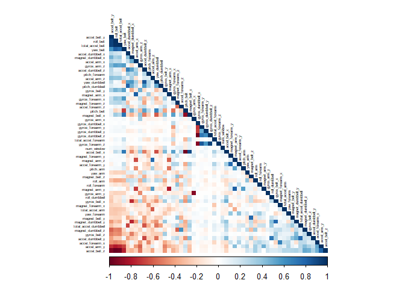
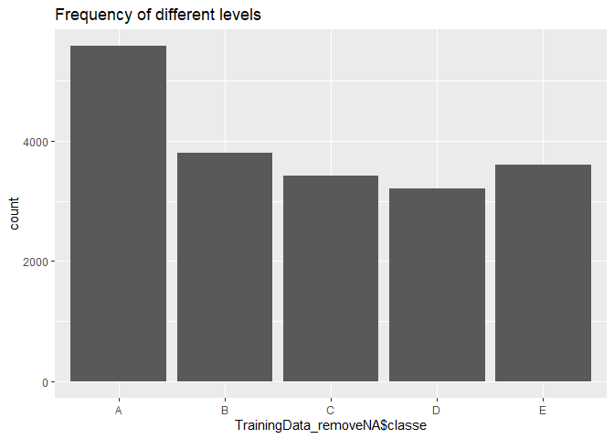
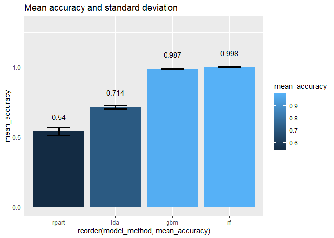
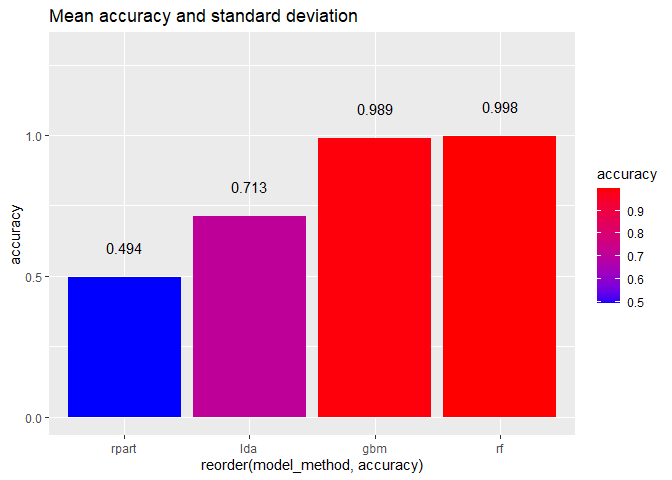

Background
----------

Using devices such as Jawbone Up, Nike FuelBand, and Fitbit it is now
possible to collect a large amount of data about personal activity
relatively inexpensively. These type of devices are part of the
quantified self movement – a group of enthusiasts who take measurements
about themselves regularly to improve their health, to find patterns in
their behavior, or because they are tech geeks. One thing that people
regularly do is quantify how much of a particular activity they do, but
they rarely quantify how well they do it. In this project, my goal will
be to use data from accelerometers on the belt, forearm, arm, and
dumbell of 6 participants. They were asked to perform barbell lifts
correctly and incorrectly in 5 different ways.**These five different
ways were labeled as five different “classes” variable, from A to E, in
the data set.** The goal of this project is to predict the manner in
which they did the exercise by using any of the other variables.

Loading and tidying up the Data
-------------------------------

**Load required R packages and set a seed.**

``` r
library(lattice)
library(ggplot2)
library(caret)
library(rpart)
library(rpart.plot)
library(corrplot)
```

    ## corrplot 0.90 loaded

``` r
library(rattle)
```

    ## Loading required package: tibble

    ## Loading required package: bitops

    ## Rattle: A free graphical interface for data science with R.
    ## Version 5.4.0 Copyright (c) 2006-2020 Togaware Pty Ltd.
    ## Type 'rattle()' to shake, rattle, and roll your data.

``` r
library(randomForest)
```

    ## randomForest 4.6-14

    ## Type rfNews() to see new features/changes/bug fixes.

    ## 
    ## Attaching package: 'randomForest'

    ## The following object is masked from 'package:rattle':
    ## 
    ##     importance

    ## The following object is masked from 'package:ggplot2':
    ## 
    ##     margin

``` r
library(RColorBrewer)

set.seed(222)
```

**Set the URLs**

``` r
TrainDataURL <- "https://d396qusza40orc.cloudfront.net/predmachlearn/pml-training.csv"
TestDataURL <- "https://d396qusza40orc.cloudfront.net/predmachlearn/pml-testing.csv"
```

**Download and clean the datasets**

``` r
TrainingData <- read.csv(url(TrainDataURL), na.strings=c("NA","#DIV/0!",""))
TestingData <- read.csv(url(TestDataURL), na.strings=c("NA","#DIV/0!",""))
```

**Check for the datasets dimemsions**

``` r
dim(TrainingData)
```

    ## [1] 19622   160

``` r
dim(TestingData)
```

    ## [1]  20 160

**Remove NA and Near Zero variance (NZV) variables**

``` r
AllNA    <- sapply(TrainingData, function(x) mean(is.na(x))) > 0.95
TrainingData_removeNA <- TrainingData[,AllNA==FALSE]
NZV <- nearZeroVar(TrainingData_removeNA)
TrainingData_removeNA <- TrainingData_removeNA[,-NZV]
```

**Check for the datasets dimemsions after remove NA and NZV**

``` r
dim(TrainingData_removeNA)
```

    ## [1] 19622    59

**Remove identification only variables**

``` r
TrainingData_removeNA  <- TrainingData_removeNA[, -(1:5)]
```

**Check for the datasets dimemsions after remove identification only
variables**

``` r
dim(TrainingData_removeNA)
```

    ## [1] 19622    54

**Coorection Analysis**

``` r
corMatrix <- cor(TrainingData_removeNA[, -54])
corrplot(corMatrix, order = "FPC", method = "color", type = "lower", 
         tl.cex = 0.4, tl.col = rgb(0, 0, 0))
```



As the correlations are quite few, PCA will not be applied for this
assignment.

**Examine the Training Dataset by Showing its Frequency**

``` r
ggplot(data.frame(TrainingData_removeNA$classe), aes(x=TrainingData_removeNA$classe))+geom_bar()+labs(title="Frequency of different levels")
```



Based on the frequency distribution, it shows that each level frequency
is within the same order of magnitude of each other.

**create a partition for training and validation on 70, 30 ratio**

``` r
inTrain  <- createDataPartition(TrainingData_removeNA$classe, p=0.7, list=FALSE)
my_TrainSet <- TrainingData_removeNA[inTrain, ]
my_ValidationSet  <- TrainingData_removeNA[-inTrain, ]
```

Prediction Model Building
-------------------------

**Fitting three models and comparing: Decision tree, linear discriminant
analysis, gradient boosting and random forest.**

``` r
fitControl <- trainControl(method="cv", number=10)

fitTree <- train(classe~., method="rpart", data = my_TrainSet, trControl=fitControl)
fitlda <- train(classe~., method="lda", data = my_TrainSet, trControl=fitControl)
fitgbm <- train(classe~., method="gbm", data = my_TrainSet, verbose=F, trControl=fitControl)
fitrf <- train(classe~., method="rf", data = my_TrainSet, trControl=fitControl)
```

**Inspecting cross validation accuracy (mean) and variability (standard
deviation)**

``` r
model_accuracy <- data.frame(
        model_method = c("rpart", "lda", "gbm", "rf"),
        mean_accuracy = round( c(mean(fitTree$resample$Accuracy), mean(fitlda$resample$Accuracy), mean(fitgbm$resample$Accuracy), mean(fitrf$resample$Accuracy)),3),
        sd = c(sd(fitTree$resample$Accuracy), sd(fitlda$resample$Accuracy), sd(fitgbm$resample$Accuracy), sd(fitrf$resample$Accuracy))
)

ggplot(model_accuracy, aes(x=reorder(model_method,mean_accuracy), y=mean_accuracy, fill = mean_accuracy, ymax = 1.3))+
        geom_bar(stat = "identity")+
        geom_errorbar( aes(x=model_method,mean_accuracy, ymin=mean_accuracy-sd, ymax=mean_accuracy+sd), width=0.4, size=1.3)+
        geom_text(aes(label = mean_accuracy, vjust = -2))+
        labs(title="Mean accuracy and standard deviation")
```



Random forest model has the highest mean accuracy and lowest standard
deviation.

**Checking prediction accuracy on validation set.**

``` r
validationTree <- predict(fitTree,my_ValidationSet)
validationlda <- predict(fitlda, my_ValidationSet)
validationgbm <- predict(fitgbm, my_ValidationSet)
validationrf <- predict(fitrf, my_ValidationSet)

confusionMatrix(validationTree,as.factor(my_ValidationSet$classe))$overall[1]
```

    ##  Accuracy 
    ## 0.4944775

``` r
confusionMatrix(validationlda,as.factor(my_ValidationSet$classe))$overall[1]
```

    ##  Accuracy 
    ## 0.7131691

``` r
confusionMatrix(validationgbm,as.factor(my_ValidationSet$classe))$overall[1]
```

    ## Accuracy 
    ## 0.988955

``` r
confusionMatrix(validationrf,as.factor(my_ValidationSet$classe))$overall[1]
```

    ##  Accuracy 
    ## 0.9984707

``` r
validationmodel_accuracy <- data.frame(
        model_method = c("rpart", "lda", "gbm", "rf"),
        accuracy = round( c(confusionMatrix(validationTree,as.factor(my_ValidationSet$classe))$overall[1],
                            confusionMatrix(validationlda,as.factor(my_ValidationSet$classe))$overall[1],
                            confusionMatrix(validationgbm,as.factor(my_ValidationSet$classe))$overall[1],
                            confusionMatrix(validationrf,as.factor(my_ValidationSet$classe))$overall[1]),3)
        )


ggplot(validationmodel_accuracy, aes(x=reorder(model_method,accuracy), y=accuracy, fill = accuracy, ymax = 1.3))+
        scale_fill_gradient(low="blue", high="red")+
        geom_bar(stat = "identity")+
        geom_text(aes(label = accuracy, vjust = -2))+
        labs(title="Mean accuracy and standard deviation")
```



All models preforms as expected.

Applying the selected model to the test data
--------------------------------------------

``` r
prediction <- predict(fitrf, TestingData)
data.frame(prediction)
```

    ##    prediction
    ## 1           B
    ## 2           A
    ## 3           B
    ## 4           A
    ## 5           A
    ## 6           E
    ## 7           D
    ## 8           B
    ## 9           A
    ## 10          A
    ## 11          B
    ## 12          C
    ## 13          B
    ## 14          A
    ## 15          E
    ## 16          E
    ## 17          A
    ## 18          B
    ## 19          B
    ## 20          B
